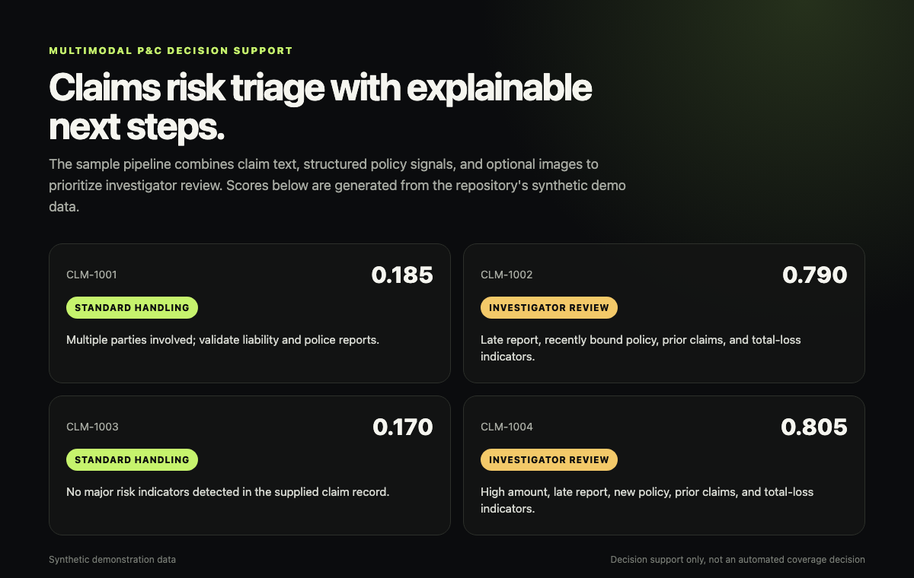
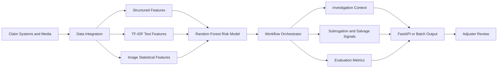
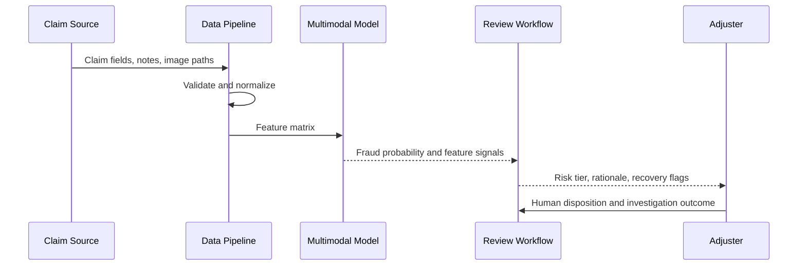

# Multimodal P&C Claims Risk Triage

**Decision-support prototype that combines structured claim data, narrative text, and image signals to prioritize insurance investigations.**

The system demonstrates an end-to-end path from claim ingestion to fraud-risk scoring, investigation context, recovery indicators, and model evaluation. It is designed to support adjusters, not replace claim decisions.



## Problem Statement

Claims teams receive evidence in multiple formats: policy and loss fields, adjuster notes, claimant narratives, and images. Reviewing each source separately makes triage slower and can hide cross-modal inconsistencies.

This project tests whether a single workflow can:

- normalize heterogeneous claim inputs;
- combine structured, text, and image features;
- score fraud risk consistently;
- produce an investigator-readable rationale;
- identify possible subrogation or salvage paths; and
- measure model quality without making autonomous claim decisions.

## Architecture



## Workflow Components

| Component | Responsibility |
| --- | --- |
| Data integration | Validates schema and assembles structured, narrative, and image inputs |
| Multimodal model | Combines feature groups and returns a fraud probability |
| Investigation | Converts model and rule signals into review context and next actions |
| Evaluation | Reports classification performance and supports threshold review |
| Recovery analysis | Flags third-party, subrogation, total-loss, and salvage language |

The orchestration layer is implemented under `src/orchestrator.py`; component details are documented in [Architecture](docs/ARCHITECTURE.md) and [Workflow Components](docs/AGENTS.md).

## Tech Stack

- Python, Pandas, NumPy
- Scikit-learn random forest and TF-IDF
- Pillow-based image feature extraction
- Optional PySpark ingestion path
- FastAPI delivery layer
- Pytest and Ruff in GitHub Actions
- Optional language-model rationale adapter with deterministic fallback

## Data Flow



## Repository Structure

```text
src/models/       Multimodal feature extraction and model pipeline
src/pipelines/    Local and optional distributed ingestion
src/agents/       Investigation, evaluation, integration, and recovery components
src/utils/        Text processing and explanation adapters
scripts/          Training, scoring, and synthetic-image utilities
docs/             Architecture and schema documentation
tests/            Pipeline regression tests
```

## Quick Start

```bash
python -m venv .venv
source .venv/bin/activate
pip install -r requirements.txt
```

Train and score the sample data:

```bash
python -m src.main --mode train \
  --data data/sample/claims.jsonl \
  --model-out artifacts/model.pkl

python -m src.main --mode score \
  --data data/sample/claims.jsonl \
  --model-in artifacts/model.pkl
```

Run the API:

```bash
uvicorn src.api:app --host 127.0.0.1 --port 8000
```

API documentation is available at `http://127.0.0.1:8000/docs`.

## Testing

```bash
pytest -q
ruff check .
```

The regression suite validates ingestion, feature assembly, training, scoring, workflow output, and deterministic fallbacks.

## Configuration

`config.yaml` controls fields, model parameters, fraud threshold, investigation rules, and optional rationale generation. Keep external rationale generation disabled when no approved provider and data-governance path exists.

## Security and Responsible Use

- No production claim or policyholder data belongs in this repository.
- External rationale providers must receive de-identified, policy-approved inputs only.
- Model output is a prioritization signal, not proof of fraud.
- Final claim action requires human review, documented evidence, and an appeal path.
- Thresholds should be evaluated for false positives and subgroup impact before operational use.
- Secrets are loaded from environment variables and are never required for the deterministic path.

## Current Limitations

- The included model and data are a baseline demonstration, not carrier-validated production assets.
- Image features are statistical descriptors rather than learned vision embeddings.
- No production model registry, drift monitor, feature store, or case-management integration is included.
- Fraud labels can encode investigation bias; operational evaluation must account for label quality.

## Future Improvements

- Calibrated probability outputs and cost-sensitive threshold selection
- Learned vision embeddings with image-quality checks
- Drift monitoring and reviewer-feedback capture
- Model registry and reproducible experiment tracking
- Fairness review across claim, product, geography, and customer segments
- Integration contract for a claims case-management platform

## Disclaimer

This repository is a technical portfolio prototype. It must not be used to deny, delay, or investigate real claims without legal, compliance, actuarial, data-governance, and human-review controls.
